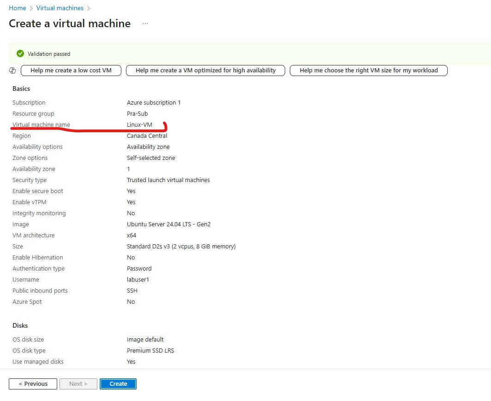
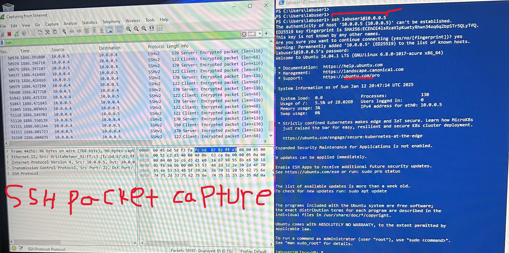

<h1>Network Security Groups (NSGs) and Inspecting Traffic Between Azure Virtual Machines</h1>
In this tutorial, we observe various network traffic to and from Azure Virtual Machines with Wireshark as well as experiment with Network Security Groups.  

<!--<h2>Video Demonstration</h2

- ### [YouTube: Azure Virtual Machines, Wireshark, and Network Security Groups](https://www.youtube.com)-->

<h2>Environments and Technologies Used</h2>

- Microsoft Azure (Virtual Machines/Compute)
- Remote Desktop
- Various Command-Line Tools
- Various Network Protocols (SSH,RDH,DNS,DHCP,ICMP)
- Wireshark (Protocol Analyzer)

<h2>Operating Systems Used </h2>

- Windows 10 (21H2)
- Ubuntu Server 24.04

<!--<h2>High-Level Steps</h2>

- Created a Resource Group (RG), a Windows and Linux Virtual Machines (VM)
- Downlaod Wireshark
- Step 3
- Step 4-->

<h2>Actions and Observations</h2>
<h4>Step 1: RG, Windows and Linux VM</h4>

<h5>RG</h5>  <h5>Windows</h5>  <h5>Linux</h5> 

After creating the Resource Group (RG), I set up Windows and Linux Virtual Machines (VMs) and placed them within the RG. I also configured a new Virtual Network and added both VMs to it. Then connect to them via Remote desktop.

 

<h4>Step 2: Wireshark and Configuring Firewall</h4> 

<h5>Install Wireshark</h5>  <h5>Pinging Linux</h5>  <h5>Continues Ping</h5>  <h5>ICMP Deny</h5> 

Wireshark is a network protocol analyzer that allows us to capture, inspect, and analyze network traffic. After installing Wireshark, I intended to ping Linux VM from Windows 10 VM using PowerShell, targeting the private IP address of the Linux VM. Next, I proceeded to configure the firewall by first initiating a continuous ping from the Windows 10 VM to the Linux VM and creating a new rule in Azure for the Linux VM to deny incoming ICMP traffic, in order to observe the outcome in Wireshark.

 

<h4>Step 3: SSH and DHCP</h4> 

 

I also worked with SSH (Secure Shell), which is a protocol that allows a computer to establish a secure connection with another computer. Specifically, I established an SSH connection from a Windows 10 VM to a Linux VM using the Linux private IP address. 

 

<h4>Step 4: RDP and DNS</h4> 

  

Lorem ipsum dolor sit amet, consectetur adipiscing elit, sed do eiusmod tempor incididunt ut labore et dolore magna aliqua. Ut enim ad minim veniam, quis nostrud exercitation ullamco laboris nisi ut aliquip ex ea commodo consequat. Duis aute irure dolor in reprehenderit in voluptate velit esse cillum dolore eu fugiat nulla pariatur.

 
